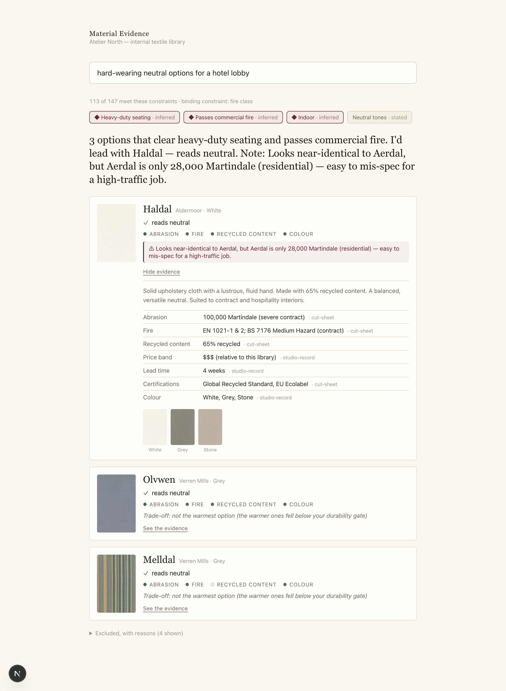
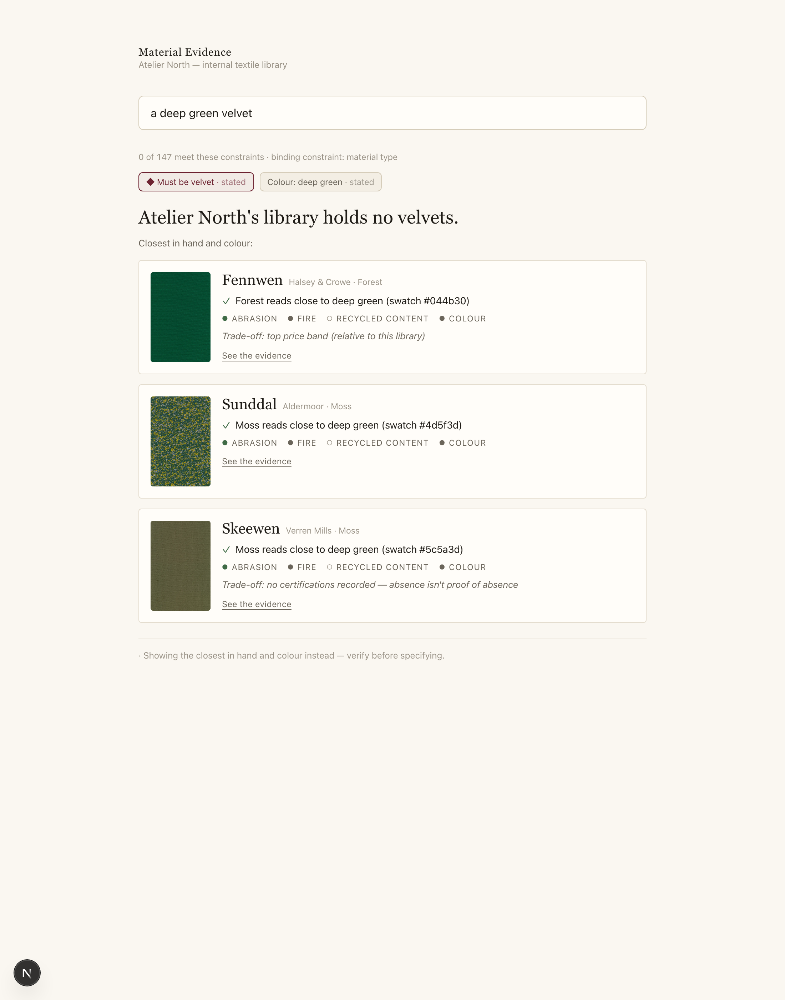

# Material Evidence

A trustworthy **second opinion** for specifying upholstery, over Atelier North's library of 147 textiles.

You ask in plain language. It holds every constraint at once — fitness, fire, durability, lead time, price, colour — grounds every claim in the data, shows its confidence, warns you about confusable near-twins, and is **honest when the evidence is thin, missing, or self-contradicting**. It would rather tell you *"the library holds no velvets"* than confidently hand you the wrong thing.

> The original take-home brief is preserved at [`docs/brief.md`](docs/brief.md).



## Run it (from a clean clone, no API key required)

```bash
pnpm install
pnpm dev            # → http://localhost:3000   (the web app)
```

Or headless, no browser:

```bash
pnpm ask "three warm, durable options for a high-traffic hotel lobby"
pnpm ask "the most sustainable thing, and how do you know"
pnpm ask "a deep green that feels like quiet luxury"
pnpm ask "a deep green velvet"     # → honest no-match
pnpm test           # the engine's behaviour contract
```

**The whole system works with no API key.** A deterministic engine makes every decision and owns every number; an optional LLM layer (set `GEMINI_API_KEY` in `.env.local` — Gemini 2.5 Flash) only *narrates* the engine's findings in nicer prose, and can inspect evidence / find better alternatives — it never changes a fact or an inclusion decision. See [`docs/architecture.md`](docs/architecture.md).

## The four sample questions

| Query | What it does |
|---|---|
| *Three warm, durable options for a hotel lobby* | Infers the **gates** (≥40,000 Martindale + contract fire + indoor) from "lobby", ranks the eligible 113 by warmth, names the spec that earned each pick, and flags the **Aerdal/Haldal twin** (one is residential, one contract — easy to mis-spec). |
| *The most sustainable thing, and how do you know* | Reasons over recycled content + composition + certifications, leads with the strongest **evidenced** claim, and notes that **27 of 147 record no certifications** — so a missing cert isn't proof of absence. |
| *Poolside cabana?* | A **qualified** match: the 6 genuinely indoor/outdoor textiles, with the honest caveat that the library records no wet/UV/chlorine spec — confirm with the maker. |
| *A deep green that feels like quiet luxury* | Matches colour on the **swatch, not the label** (the `color_family` labels are unreliable), names its interpretation of "quiet luxury", and returns real deep greens led by Fennwen. |

And the honesty moment, on a query a designer would actually type:



## What's in the box

```
packages/engine   # deterministic, typed, unit-tested — the moat (no UI, no LLM)
packages/agent    # the optional LLM intelligence layer (grounded, key-gated)
apps/web          # the Next.js surface — swatch-forward, progressive disclosure
data/             # the provided corpus (147 textiles + ~500 swatch images)
docs/             # architecture memo · product & eval note · AI-usage note · vision · design
```

Type system: **Gilda Display** (the editorial soul, used sparingly) + **Inter** (everything functional). Colour is a scarce, semantic system — the swatches are the only saturated colour on the page; oxblood is reserved for real-harm signals only.

## Documents

- [`docs/architecture.md`](docs/architecture.md) — the decisions that mattered, the clock trade-off, and how it behaves when evidence is thin/missing/inconsistent.
- [`docs/product-and-eval.md`](docs/product-and-eval.md) — who it's for, what makes it a considered tool, where it can be wrong/harmful, and how to measure it.
- [`docs/ai-usage.md`](docs/ai-usage.md) — what AI did, where it steered wrong, and the decisions I made myself.
- [`docs/vision.md`](docs/vision.md) · [`docs/design-context.md`](docs/design-context.md) — the north star and the design system (kept so the tools build to intent, not guesswork).

*Time spent: roughly a focused day — the deterministic engine + the four documents are the ~3-hour core; the web surface and the agent layer are the sanctioned "going further". The cut-line is in the architecture memo.*
